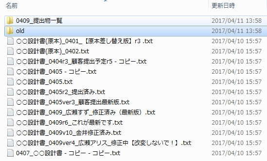
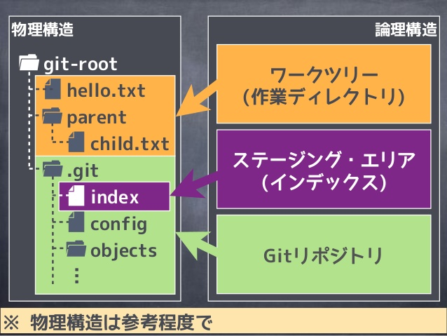
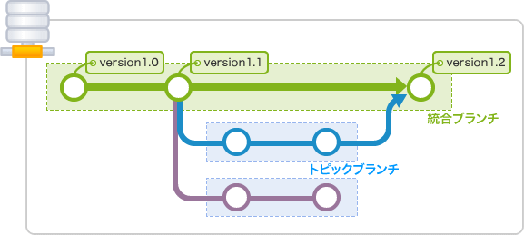

<!-- $theme: default -->

git勉強会
==
###### 本当の働き方改革がここに、、、ある！ '18夏
---

## 第１部
gitとは
==
---

ファイルサーバで作業してると・・
==
- よくこんなことになりませんか・・・
 
- どれが顧客提出版？多分これかな。えっ違うの！？
- この項目を入れたのは誰だぁ～～！
- 古い（と思った）ファイルをoldに入れたら怒られた(´・ω・`)
- 数行しか変えてないのに別名で保存するのか・・・もったいねえ・・
---

さらに・・・
==
- メールで資料の指摘をするのが大変
	- ファイル「abc.xls」のX行目のOOはZZのほうがいいと思います（めんどくせえ・・）
- もう2度と使わないであろうファイルをoldに保存しないといけない文化
	- サーバの容量を圧迫します。
- 設計意図をQAされたとき、埋もれたメールやファイルを探し出さないといけない。

### もうファイルサーバには疲れたと、今、エンジニアのファイルサーバ離れが加速しています（弊課では）
---

gitとは
==
### プロジェクトを構成する大量のファイルを、複数人が、効率よく利用できるようにしたシステム。
- あるディレクトリについて、
	- 誰が、
	- いつ、
	- どのファイルに、
	- どんな変更をしたか
- という**履歴**を管理する。
- 更新内容がイマイチだったときに復元ポイントから全部やりなおしたり、誰かの作業分だけを確認する、というのを容易に行える。 	
---

ちなみに
==
##### Linuxカーネルのメンテナンスのために、リーナス御大ご自身が開発
- カーネルのメンテナーは、世界に数万人いる。
	- 一週間で2万箇所以上の変更が入り、1000個のファイルが変更される。
- 4万人がefilesのようなところでメンテナンスしてたらLinuxの今の発展はなかったでしょう・・・
- 名前の由来は、3文字で、言いやすくて、まだ使われていないものなら何でもよかったとのこと。
- 10日間雲隠れして一気に作り上げたらしいです。
---

gitの使い方（詳細はのちほど）
==
- gitはディレクトリ内のファイルを履歴管理する。
- どこかのディレクトリに移動して、
	```
    $ git init
    ```
    と打つと、gitが履歴を管理し始める。
- ファイルを編集し終えたら「コミット」する（後述）。ゲームでいうところのセーブみたいなもの。
- コミットは、好きなタイミングでいくらでも出来る。
- コミットには、誰が、いつ、何を変更したかが記録される。
- いろいろ触っててわけわからんくなったら、好きなコミットからやり直せる。
> やり直しが簡単というのは、ものづくりにおいて非常に重要！
---

リポジトリとは
==
### ファイルの変更履歴（＝コミット）が保管されている場所のこと
- ディレクトリでgit initすると、そこに「リポジトリ」ができる。
- 自分の作業マシンにあるリポジトリのことを**ローカルリポジトリ**という
- コミットをすると、リポジトリに履歴がどんどん積み重なっていく。
- 本当は違いますが、今の時点では、作業をしているディレクトリのことと理解してOKです。本当は違います。
---

リモートリポジトリ
==
### 自分の作業内容（＝リポジトリ）を他の人に展開するために、ネットワーク上のサーバにあるリポジトリのこと
- みんなのコミットが集まってるところ。プロジェクトはみんなの作業を取り込んで進んでいくので、リモートリポジトリは必須の要素。
- 最も有名なリモートリポジトリが、**github**

	###### monarisaちゃんかわいいい
- githubの他に、**gitlab**、**bitbucket** などがある。gitlabはLinuxにインストールしてLAN内で使うことも可能。
---

github紹介
==
### リモートリポジトリのデファクトスタンダード、オープンソースの聖地
- よく聞くオープンソースのプロジェクトはだいたいここで開発されている。
	- microsoftによる買収で、それを嫌ったプロジェクトが大量に流出しているらしい。
- 無料で利用可能。ただし無料アカウントだと、リポジトリは公開される。
	- 対抗サービスのgitlabやbitbuckuetは、無料アカウントでも非公開リポジトリを利用可能。 
- リポジトリ機能の他、様々な機能がwebで提供されている。
---

github紹介
==
### チームでの開発をサポートする強力な機能がある
##### pull request （通称プルリク）
- レビュー機能。自分の作業の提示・確認依頼の機能（後述）
##### issue
- 問題を話しあう掲示板的なもの
##### project
- カンバンによるタスク管理
##### wiki
- その名の通りwiki
##### gist
- コードスニペット。よく使うコードやメモなどを書いておける。

---

gitはプログラマだけのものではない
==
### テキストファイルならなんでも扱える。
> 正確には、diffで差分を取れるものならなんでも。
- プルリクは、diffできないと機能しない。
- 以下のファイルはgit管理に非常に向いている。さぁ今すぐLet's git.
	- NW機器のコンフィグ
	- *.conf的なサーバの設定ファイル
	- シェルスクリプト
	- *.txt的なごく普通のテキスト
	- マークダウン（後述）のような拡張テキスト
---

gitここに注意
==
### ファイルの差分が取れるのは、テキストファイルのみ
- 画像とかバイナリは差分が取れないのでgithubの強力なレビュー機能が使えない。
- ドキュメント用の写真などを置くのはOK。	 
- エクセルとかパワポなどのファイルはgit配下に置くと嫌われる。
	- markdown（後述）やxdiagなどのテキストベースに移行しよう！
- テキストとはいえ、一時的に発生するログファイルや、個人の設定ファイルなども置いてはいけない。
- 履歴が残るので、巨大なファイルもあまり喜ばれない。ただしそういうファイルを扱う仕組みもある（git LFS）
---

gitここに注意
==
### 履歴は原則、消してはいけない
- 履歴を残すためのシステムなので、履歴の削除はしてはいけない。
- 間違ってコミット〜リモートにアップしてしまった場合は、削除ではなく、修正をかけること。
	- リモートに上げる前なら削除してもOK（というかバレないようにできる）
- もちろん履歴の削除をする機能はある。でもオープンソースのプロジェクトで他人の履歴を消したりすると処刑されます。
---

ここまでのまとめ
==
### gitとは、ディレクトリ内のファイルについて、誰が、いつ、どこを変更したのかの履歴を取るシステム
- gitが履歴を格納しているところをリポジトリという。
	- 自分のマシン内のリポジトリが、ローカルリポジトリ
	- 自分のリポジトリを公開して他人と共有する場所が、リモートリポジトリ
- 最も有名なリモートリポジトリがgithub
	- オープンソースなら無料で利用可能。課金することで、非公開リポジトリを使用できる。
- gitで扱うファイルはテキストファイルのみ。
	- テキストならなんでもOK
	- バイナリファイルは差分が取れないため、画像など以外は極力テキスト化を心がける。
---

git詳細
==
### gitは、サーバ・クライアントモデル
- 自分のマシンで動くgitコマンドがクライアント
- リモートリポジトリがサーバ
### gitコマンドは、一般的なOSには標準では入っていない
- amazon linux とかGCP cloudshellには標準搭載
### gitクライアントには、GUIもある。
- sourcetree、github for mac/windowsなどなど
- pycharmやVScodeやatomなどのモダンなエディタからも使える
- クライアントは好みで選んでOK。
	> 個人的にはgitコマンドが一番使いやすいと思う。
---

gitの始め方
==
### 大きく2通りの始め方がある
#### git init
- ディレクトリをgit管理下にするコマンド
- ローカルから始めるならこちら
- リモートリポジトリを追加する作業が別途必要
#### git clone（クローン）
- リモートリポジトリからリポジトリをコピーするコマンド
- すでに始まっているプロジェクトに参加するならこちら
- リモートリポジトリの設定作業が不要なので、新しくプロジェクトを開始するときもこちらからがおすすめ。
	- 最初にgithubでリポジトリを作成→git cloneという非常に簡単な作業です。
---


コミット
==
## gitに履歴を刻み込むこと。
- ゲームで言うところの**セーブ**
- ファイルを保存しただけではコミットはされない。明示的にコミットをする必要がある。
- コミットする際には、必ずコミットメッセージを付与する必要がある（書き方は自由）
- コミットのタイミングは自由だが、１つのコミットには、1種類の変更だけを含めるべき。
	- バグを改修したついでにドキュメントの誤字を修正しても、コミットにはどちらかのみを含めるべき。
	- コミットはあとで戻るときの道標になるので、2つ以上のことを含めると面倒くさいことになる。
---

コミット詳細
==
- 変更したファイルはいきなりはコミット出来ない。
- インデックスと呼ばれるエリアに入っているファイルのみ、コミットすることができる。
- インデックスがあることで、更新したファイルのうち、コミットに含めるものとそうでないものを分けることができる。


###### http ://hamamuratakuo.blog61.fc2.com/blog-entry-1084.html
---


プッシュ
==
## 自分のコミットをリモートリポジトリに登録すること
- ゲームで言うところの、**クラウドにデータを保存**
- 自分の作業内容をプロジェクトメンバーに伝えるために使う。
- githubアカウントを持っている必要がある。
- 自分が招待されたリポジトリに対してのみ実施できる。
	- そうでないと全然関係ない人に勝手にコードを変えられてしまうので。
- コミット何回分でも1度でプッシュできる。
- ミスした状態でプッシュすると修正が大変なので、プッシュ前は一呼吸置いて内容を確認すること。
---

プル
==
## リモートリポジトリをローカルに取り込むこと
- ゲームで言うところの、**クラウドからデータをロード**
- 他人の変更を取り込む。毎朝作業前に行うのが理想。
	- プルしない状態でローカルで変更をかけてしまうと面倒くさいことになることもある。
---
コミットツリー
==

- コミットツリーの紹介
ここで見せておかないとブランチ以降で混乱する
---

ブランチ
==
## リポジトリのパラレルワールドを作ること
- ある時点のコミットを始点に、リポジトリを枝分かれさせることができる。
- １つのプロジェクトに対し複数の変更作業を同時に行えるようになる。
	- メンバー１がバグ改修担当、メンバー２が機能追加担当など。
	- ちょっと試したい機能があるけど、進行中のプロジェクトのファイルを書き換えるのは流石にまずいな。。。というときに。
- ブランチがないと、複数の作業のコミットが混在して混沌としてしまう。

---
ブランチの図
==


###### https ://backlog.com/ja/git-tutorial/stepup/stepup1_2.html
---

マージ
==
## ブランチ同士を統合すること
- パラレルワールドでそれぞれの作業を終えたら、ブランチを統合して作業内容を統合する。
- ある人の作業と別の人の作業が合体して、機能追加やバグ改修がプロジェクトに取り込まれる。
- ブランチ作成→作業→マージを繰り返して、プロジェクトは成長していく。


###### https ://backlog.com/ja/git-tutorial/stepup/stepup1_2.html
---

コンフリクト
==
## 変更箇所の重複している２つのブランチをマージしたとき、どっちを採用するか聞かれること
- ２つのブランチ間で、同じ箇所に異なる変更がされていた場合、gitにはどっちを採用していいのかわからないので質問される。
- gitでも最も恐れられ、git怖いと思われる理由No.1
- コンフリクトの起きない運用を心掛けましょう！（起きたら帰れないぞ）
---
コンフリクトの例
==
- コンフリクトの例
```
Hello
<<<<<<< HEAD
konbanwa
=======
sayounara
>>>>>>> third
```
- konbanwaかsayounaraのどっちを採用するか聞かれている。
	- << == >> の行はgitが追加したもの
- どちらかを選択、あるいはどちらも採用してコミットすればOK
---
チェックアウト
==
### 作業するブランチを切り替えること
- 
- 変更中のファイルやステージング中のファイルがある場合は切り替えできない。コミットするか、スタッシュ（一時退避）してから実施すること。

---

gitflow
==
## ブランチ運用を効率化するためのプラグイン
- ブランチは数に制限がなく、命名も自由なため、チームで運用ルールを明確にしておかないと混沌状態になる。
- 効率よいブランチ運用のモデルとして"A successful Git branching model"が提唱され、それを簡単に扱えるようにしたプラグインがgitflow 
- 上記モデルをgitコマンドで自力で実施するのではなく、簡単なコマンドで実施できるようにしたのがgitflow。リポジトリ自体に手が入るわけではないので、アンインストールなどしても特に問題ない。
---

gitflow詳細
==
## gitflowでは、以下のブランチしか使えない。
#### master
- 顧客に引き渡した最新版が置かれるブランチ。masterの直接改変は許されない。
#### develop
- masterブランチのコピーで、featureブランチの起点となる。
#### feature
- 機能追加など、一般的な作業を行うブランチ。feature/xxxの書式さえ守れば命名は自由。
#### release
- リリース準備ブランチ。リリース品の最終確認のあと、masterにマージされる。
---

gitflowでの開発の流れ
==
1. git cloneで自分のマシンにリポジトリを取り込み
2. featureブランチを作成
3. feartureブランチで作業し、コミットし、テスト
4. メンバーに見せても良い形になったら、github等にfeatureをプッシュ
5. github上でレビュー。通るまで、feartureブランチ上で作業→プッシュを繰り返す
7. レビューが通れば、developブランチにマージ
8. developブランチにメンバーの全作業がマージされたら、releaseブランチをオープンし、タグ（バージョン番号）をつける。
9. releaseブランチをmasterブランチにマージし、完了


---


A successful Git branching model
==


---

おまけ
==
##### markdownとMarp

---
markdownとは
==
## テキストマークアップ言語の一種。簡単な記法でテキストを修飾できる
- 見出し、リスト、引用などの装飾をすべてテキストだけで行える。
- wordなどと違いテキスト要素しか含まないので
	- gitで差分が取れる。
	- テキストエディタでも普通に見れる。
- githubのREADMEはこの記法で書く(書かなくてもよい)
- PDF化、HTML化なども簡単にできる。
- 一般的なIDE、VScode、atomなどのエディタでサポートされ、webブラウザで動くサービスもある。
- アンチword派から絶大な人気を誇る。これでwordを駆逐しましょう。
---

Marpとは
==
## markdownでスライドのかけるエディタ
- speeeのエンジニア服部さんが、自分の欲しいスライドエディタがなかったという理由で開発
- PDFにしか変換できないものの、スムーズにスライドが作成できて超快適
- このスライドもMarpで作成しました。

---

markdown & Marpのデモ
==
## かんたんにデモしてみます

---

## 第２部
git/githubハンズオン
==

---
最初に
==
- githubのユーザーネーム、パスワードが必要になります。今すぐ思い出してください。
- 皆で使用するリモートリポジトリ「githandson」はすでに作成済みです。 
- gitのはじめ方にはいくつかありますが、今回は作成済みのリモートリポジトリをコピーして開始する手法にします。
- カレントディレクトリが自分のホームになっていることを確認してください。
- bash-completionをインストールしてからログアウトしていない方は、一度ログインし直してください。
- 作業の単位を今回は便宜的に「プロジェクト」と呼びます。今回のプロジェクトは「自分のプロフィールファイルを作成しよう」です。

---

動作確認時のディレクトリが残っている方
==
## git clone したときのgithandsonディレクトリが残っている方は、rm -rf 等で削除をお願いします。
---

git初期設定
==
- gitを使用するために、最低限以下の設定を行う必要があります。
```
git config --global user.name "jin kanai"
git config --global user.emal メアド
```
- 上記を実行したら、以下で設定が投入されたか確認してください。
```
git config --global -l
```

### 解説
- gitは、誰が何をしたか履歴を残すものなので、必ず名前とメアドを設定する必要があります。
> 設定しないままコミットしようとすると怒られる。
---

リモートリポジトリをクローンする
==
- 以下のコマンドを実行してください。
```
git clone 
```
- カレントディレクトリに「githandson」ディレクトリが作成されたことを確認してください。

### 解説
- git cloneはリモートリポジトリをまるごとローカルに持ってくる呪文です。
- 既存のプロジェクトに参加するときによく使います。
- プロジェクト作成時でも、先にgithubでリポジトリを作るだけなのでgit initするより楽です。おすすめ！

---
gitflow初期設定
==
- gitflowを有効にするために以下の呪文を実行
```
git flow init -d
```
### 解説
- このリポジトリがgitflowで運用されることを指定するコマンドです。
- github側での設定は不要です。
- gitflowは、gitflow運用のためのgitコマンドを自動で発行しているだけなので、リポジトリには影響を与えません。
- gitflowを入れずともgitflow運用はできますが、メンバー全員が運用に参加する必要があるので、入れた方がいいです。

---
ブランチ作成
==
- 各個人で別の作業を行うため、ブランチを作成します。
```
git flow feature start あなたのお名前
```
- 以下を実行して、希望するfeatureブランチが出来ていることを確認してください。
```
git branch -a
```

### 解説
- ブランチは、いわばあなただけの作業場です。このブランチで作業している限り、プロジェクトには影響を与えませんので好きに作業してください。
- gitflowでは、作業を始めるときは必ずfeatureブランチから始める必要があります。


---
ファイル作成
==
- 作業は「あなたのプロフィール作成」にしましょう。先ほど紹介したMarkdown形式で、あたなのプロフィールを作成して保存してください。
- githandson/profile/以下に、あなたの名前でディレクトリを作成してください。
- そこに移動して、profile.mdという名前でファイルを作成し、保存まで行ってください。
- 以下、私の例
```
/home/jin/githandson/profile/jkanai/profile.md
```
- マークダウンのプレビューには、以下のサイトが便利です。
```
https://stackedit.io/
```

---
ワークツリー確認
==
- 現在のワークツリー（カレントディレクトリ）の状態を確認します。
```
git status
```
- こんな表示がでましたか？
```
Untracked files:
  (use "git add <file>..." to include in what will be committed)
  ./
```
### 解説
- Untracked filesは、ワークツリー内で、追加されたけどまだgit管理下に入っていないファイルのことで、このままではコミットされません。
- 他の作業と一緒にコミットしたいなど、あえてコミットしない場合、このまま放置してもよいです。

---
ステージングする
==
- コミットするためには、ステージングもしくはインデックスと呼ばれるエリアにファイルを登録する必要があります。
```
git add profile.md
```
- そして再度 git status
```
Changes to be committed:
  (use "git reset HEAD <file>..." to unstage)

        new file:   profile.md
```
- これでコミットできます。
### 解説
- コミットは過去に戻るときの目印になるので、修正した単位できっちりと行うのが理想です。ステージングを使うことで、単位ごとにコミットを分けられます。
---

コミット
==
- ようやくコミットできます。gitに歴史を刻むときがきました。
```
git commit -m "はじめてのコミット"
```
- 確認しましょう
```
git log
``` 
- 一番上に今のコミットが表示されたはずです。
### 解説
- gitに歴史を刻んだので、ここから先何かまずい変更をしてしまっても、簡単にここに戻ってこれます。
- 今後githubに上げて、誰かがファイルを改変しても、誰がいつ何の変更を加えたかがすぐわかります。
- ちなみに名前とメアドを設定していない場合、コミットできずにここで入力を迫られます。
---

プッシュ
==
- 続けて、githubにアップロード・・・いや、プッシュします。
```
git push origin feature/あなたの名前
```
- これで、githubにあなたの作業がメンバー全員に公開されました。
### 解説
- 共有リポジトリ（＝リモートリポジトリ）にファイルを追加しましたが、追加先はあなた専用のブランチなので、他の人には影響を与えません。
- 逆に、masterブランチのような納品物を収めている（皆が共有している）ブランチに直接プッシュは絶対してはいけません。
- コミットの取り消しや変更は、プッシュ以後は原則行ってはいけません。プッシュ前は、必ず一呼吸置く癖をつけましょう。


---
プルリクエスト発行
==
- feartureブランチは自分の勝手な変更なので、プロジェクトにマージするには皆に内容を確認してもらい、承認を得る必要があります。
- プルリクエストを作成し、メンバーにレビューを促します。
- 以下のURLを開いてください。
```
https://github.com/pymee/githandson
```
### 解説
- githubの最も強力なツールがこのプルリクエスト、通称プルリクです。
- 自分の変更をメンバーに提示し、同意を得られて初めてプロジェクトに取り込まれます。
- マージの了承を得るので「マージリクエスト」とも呼ばれます。
---

プルリクエスト発行
==

- New pullrequestボタンをクリック
- baseをdevelopに、compareをfeatureブランチに変更。
- タイトルを「私のプロフィールを確認してください」に変更。
- 下のコメント欄になにか適当に記載してください。
- 右のreviewerで、jin kanaiを指定してください。
- ここまでできたら、create pull requestボタンを押してください。
- 完成したプルリクが見えるので見回してください。
---
レビュー実施
==
- プルリクエストタブをクリックすると、全員のプルリクが大量に表示されます。好きなプルリクを選んでクリックしてください。
- 右上の「files changed」タブをクリックしてください。
- このブランチをプッシュした人の変更が表示されます。なにか指摘したい行にカーソルを持っていくと＋ボタンが表示され、クリックするとコメントが書けます。
- コメントを書いたらstart reviewボタンを押してください。
- 同じ要領でコメントを書きます。2回目以降、ボタンはadd commentにかわります。
---

レビュー実施
==
- こころゆくまでコメントを書いたら、右上の「review change」ボタンを押してください。
- レビューの総括コメントを書けるので、総括を書いて下さい。
- レビューの結果を３つから選択します。
	- comment: ただのコメントです、気になったら対応してくださいとか、そんなレベル。
	- approve: 問題ないので承認します。
	- change request: 問題、指摘があるので変更を要求します。
- 今回は再プッシュしてもらうため、change requestを選択して、submit reviewボタンを押してください。
- この時点で、あなたのコメントが皆に見えるようになります。  

---
レビュー補足
==
- reviewerに指定された人は、レビューをしなければなりません。レビューをいつまでたってもしない人には、PMが催促してください。
- レビュー結果は、変更要求がある際はchange requestにしてください。なんとなく遠慮でcommentにしたい気持ちはわかりますが、レビューは意思を伝える場なので遠慮は要りません（ただし個人攻撃の場ないです）
- レビューア全員がapproveするまで、そのプルリクをマージしてはいけません。
- 画面の下のほうに、マージ先ブランチとコンフリクトが起きているかどうかが確認できます。もし発見したら、早めに修正しておいたほうがなにかと無難です。
---

レビュー指摘事項反映と再レビュー
==
- レビューで指摘された内容を修正してください。もしくは、github上で議論してもOKです。SNSのような感覚で行えます。
- 修正したら、コミットし、再度プッシュしてください。
- レビューアは、修正コミットを再度確認し、approveしてください。時間の関係で、納得行かなくてもapproveしてください。
---

developブランチへのマージ
==
- 自分の変更箇所をメンバーが確認し、マージの同意を得たので、いよいよプロジェクト本流であるdevelopブランチに自分のfeatureブランチをマージします。
- 以下を実行してください。
```
git flow feature finish あなたのお名前
```
- エディタ（多分vi）が起動し、このマージのコミットメッセージを聞かれます。特に変更しなくていいので、そのまま:wqしてください。
> もしvi以外のエディタが起動したら・・・呼んでください。
---
developブランチへのマージ
==


---

リリース
==


---

gitignore
==


---

---
githubの便利機能
==

---

